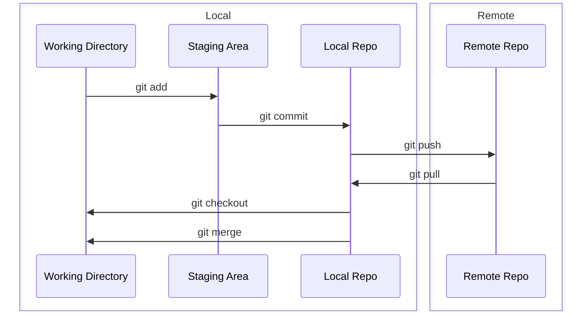
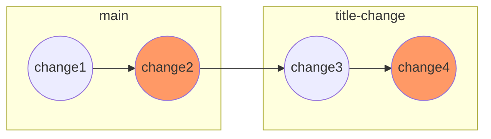
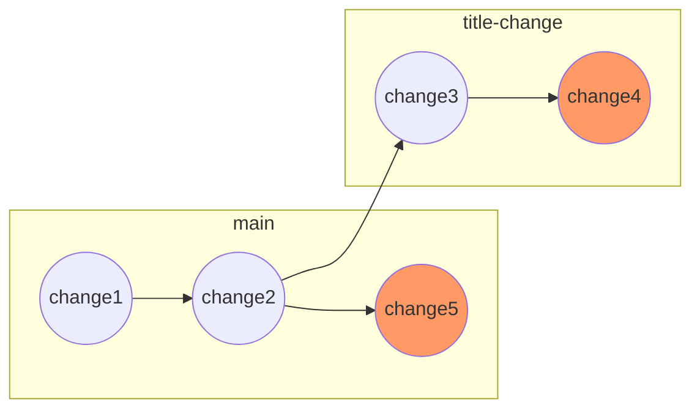
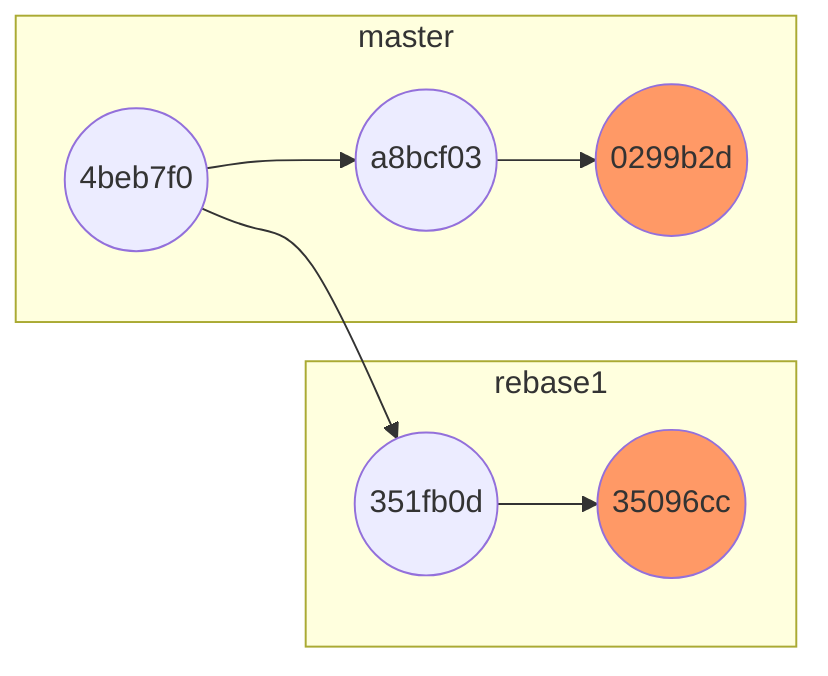
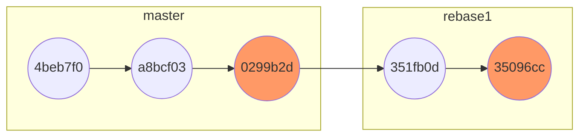
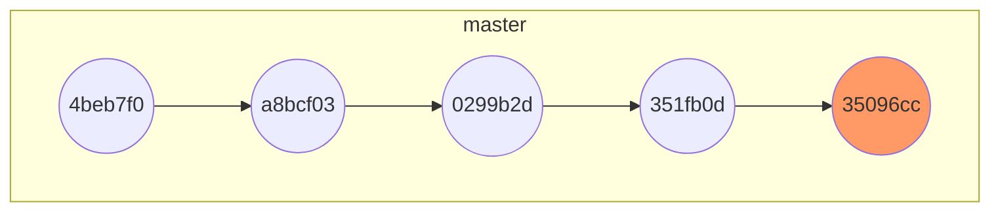

# Git 



## Creating a git repository
There are two options.
1) Start local a local git repository 
```
git init
git init <folder>
```
2) Clone a remote git repository
```
git clone https://github.com/desertwind77/starter-web.git
```

From `git status`, we are on the `master` branch and is up to date with the remote repository `origin/master`.

```
bash-3.2$ git status
On branch master
Your branch is up to date with 'origin/master'.
```

## Adding a new file
After adding two new files, file1.txt and file2.txt, `git status` shows that we have two untracked files.
```
bash-3.2$ git status
On branch master
Your branch is up to date with 'origin/master'.

Untracked files:
  (use "git add <file>..." to include in what will be committed)
        file1.txt
        file2.txt

nothing added to commit but untracked files present (use "git add" to track)
```

`git add` will move the file to the staging area. See that file1.txt is in the staging areas and ready to be committed while file2.txt is still untracked.
```
bash-3.2$ git add file1.txt
bash-3.2$ git status
On branch master
Your branch is up to date with 'origin/master'.

Changes to be committed:
  (use "git restore --staged <file>..." to unstage)
        new file:   file1.txt

Untracked files:
  (use "git add <file>..." to include in what will be committed)
        file2.txt 
```
Then we commit to the master branch with the commit id `6a6f8e6`. To add files recursively, use `git add .`. The option `-m` in `git commit` is to add a one-line comment and avoid bringing up the text editor.
```     
bash-3.2$ git commit -m "Adding file1"
[master 6a6f8e6] Adding file1
 1 file changed, 15 insertions(+)
 create mode 100644 file1.txt
```
Once we commit file2.txt, the local repository will be two commits ahead of the master branch on the remote repository or `origin/master`.
```
# -A or --all means "add changes from all tracked and untracked files"
bash-3.2$ git add -A
bash-3.2$ git commit -m "Adding file2"
[master cee6a0e] Adding file2
 1 file changed, 15 insertions(+)
 create mode 100644 file2.txt
bash-3.2$ git log
cee6a0e  (HEAD -> master) Adding file2
6a6f8e6  Adding file1
4beb7f0  (origin/master, origin/HEAD) Merge pull request #6 from jasongtaylor/feature-readme
e73f914  Adding Purpose section to README
34f563b  Adding README file
5c05047  Copying files from initializr project zip file and then creating simple.html as basis for super simple pages
```
For git tracked files, we can combine `git add` and `git commit` into one step by using `git commit -am "comment"`. git tracked files are
- tracked files whether they are in the staging area or not
- untracked files in the staging area.

To see all git tracked files, do `git ls-files`.

## Comparison
Compare between the current working directory and the staging area.
```
git diff
```
Compare between the current working directory and `HEAD` which is the last commit.
```
git diff HEAD
```
Compare between the staging area and the last commit
```
git diff --staged
git diff --staged HEAD
```
Show the diff of only one file
```
git diff -- README.md
```
Compare the latest commit with the one before that. `HEAD^` means the previous commit before `HEAD`. We can use multiple `^` (read Carrot).
```
git diff HEAD HEAD^
```
Compare two CommitIds
```
git diff 5c05047 6a6f8e6
```
Compare between the local repository and the remote repository. If we run `git log`, we will see that there is a change labelled with `origin/master`. That's the latest change on `origin/master`. This also the same as how to compare branches.
```
git diff master origin/master
```
## Backing out changes
`git status` shows how to do it. READ.md has both staged change nad unstaged change.
```
bash-3.2$ git status
On branch master
Your branch is ahead of 'origin/master' by 2 commits.
  (use "git push" to publish your local commits)

Changes to be committed:
  (use "git restore --staged <file>..." to unstage)
        modified:   README.md

Changes not staged for commit:
  (use "git add <file>..." to update what will be committed)
  (use "git restore <file>..." to discard changes in working directory)
        modified:   README.md
```

`git restore <file>` discard the change in the file and `git restore --staged <file>` moves the file change out of the staging area.

## Renaming, moving and deleting files
There are two ways to do it.
1) Use the git commands. To rename or move a file uses `git mv` and to delete a file `git rm`.
```
bash-3.2$ git rm file1.txt
rm 'file1.txt'

bash-3.2$ git status
On branch master
Your branch is ahead of 'origin/master' by 2 commits.
  (use "git push" to publish your local commits)

Changes to be committed:
  (use "git restore --staged <file>..." to unstage)
        deleted:    file1.txt
```
2) Use the shell commands e.g. `mv` or `rm` and then `git add -A`.
```
bash-3.2$ rm file1.txt
bash-3.2$ git status
On branch master
Your branch is ahead of 'origin/master' by 2 commits.
  (use "git push" to publish your local commits)

Changes not staged for commit:
  (use "git add/rm <file>..." to update what will be committed)
  (use "git restore <file>..." to discard changes in working directory)
        deleted:    file1.txt

no changes added to commit (use "git add" and/or "git commit -a")
bash-3.2$ git add -A
bash-3.2$ git status
On branch master
Your branch is ahead of 'origin/master' by 2 commits.
  (use "git push" to publish your local commits)

Changes to be committed:
  (use "git restore --staged <file>..." to unstage)
        deleted:    file1.txt
```
what is git add -u? (chapter 31)

## Show git commit history
Use `git log` and customize the format in `.gitconfig`.
```
[user]
   name = Athichart Tangpong
   email = victorybattleship@gmail.com
[core]
   autocrlf = false
   editor = vim
   safecrlf = true
   excludesfile = ~/.gitignore
[alias]
   co = checkout
   ci = commit
   st = status
   br = branch
   hist = log --pretty=format:\"%C(auto)%h %ad | %s%d [%an]\" --graph --date=short
   type = cat-file -t
   dump = cat-file -p
[filter "lfs"]
   required = true
   clean = git-lfs clean -- %f
   smudge = git-lfs smudge -- %f
   process = git-lfs filter-process
[format]
   pretty = format:%C(auto)%h %d%Creset %s
[color]
   ui = true
```
Output of `git log`
```
* cee6a0e 2023-09-16 | Adding file2 (HEAD -> master) [Athichart Tangpong]
* 6a6f8e6 2023-09-16 | Adding file1 [Athichart Tangpong]
*   4beb7f0 2015-09-02 | Merge pull request #6 from jasongtaylor/feature-readme (origin/master, origin/HEAD) [Jason Taylor]
|\
| * e73f914 2015-09-02 | Adding Purpose section to README [Jason Taylor]
| * 34f563b 2015-09-02 | Adding README file [Jason Taylor]
|/
* 5c05047 2014-09-11 | Copying files from initializr project zip file and then creating simple.html as basis for super simple pages [Jason Taylor]
```

## Pushing the change to the remote repository
To upload the local repository to the remote repository, do the following.
```
# We need this only when this is a local repository which is 
# not a clone of a remote repository. In other words, it was
# created by git init.
git remote add origin https://github.com/desertwind77/starter-web.git

# It is a good practice to do pull before pull.
git pull origin master

# Really push the change to the remote repository.
git push origin master
```

## Branching
`git branch -a` is to show all the branches in the repository. `*` means the active branch.
```
bash-3.2$ git branch -a
* master
  remotes/origin/HEAD -> origin/master
  remotes/origin/master
```
`git branch <branch name>` is to create a new branch and `git checkout <branch name>` to switch to the branch.
```
bash-3.2$ git branch mynewbranch
bash-3.2$ git branch -a
* master
  mynewbranch
  remotes/origin/HEAD -> origin/master
  remotes/origin/master
bash-3.2$ git checkout mynewbranch
D       file1.txt
Switched to branch 'mynewbranch'
bash-3.2$ git branch -a
  master
* mynewbranch
  remotes/origin/HEAD -> origin/master
  remotes/origin/master
```
After `git checkout`, the pointer `HEAD` points to `mynewbranch`. This is where the future commits will go to. Notice that a branch is just a label. 
```
bash-3.2$ git log
cee6a0e  (HEAD -> mynewbranch, master) Adding file2
6a6f8e6  Adding file1
4beb7f0  (origin/master, origin/HEAD) Merge pull request #6 from jasongtaylor/feature-readme
e73f914  Adding Purpose section to README
34f563b  Adding README file
5c05047  Copying files from initializr project zip file and then creating simple.html as basis for super simple pages
```

To rename a branch, do the following.
```
bash-3.2$ git branch -m mynewbranch newbranch
bash-3.2$ git branch -a
  master
* newbranch
  remotes/origin/HEAD -> origin/master
  remotes/origin/master
```
To delete a branch, do the following. Note that we must be in a different branch in order to delete a branch.
```
bash-3.2$ git checkout master
D       file1.txt
Switched to branch 'master'
Your branch is ahead of 'origin/master' by 2 commits.
  (use "git push" to publish your local commits)
bash-3.2$ git branch -d newbranch
Deleted branch newbranch (was cee6a0e).
bash-3.2$ git branch -a
* master
  remotes/origin/HEAD -> origin/master
  remotes/origin/master
```
To create and switch to (checkout) a new branch at the same time. 
```
git checkout -b title-change
```
To merge the change up to the parent branch, `master` here. Assume that we created and checked out a new branch, called title-change. Then we modified a file and committed the change. 

In this case, there is no change in `master` after `tittle-change` has been created. So `git merge` just means fast forward.
```
# Compare between master and title-change
bash-3.2$ git diff master title-change

# Switch to master
bash-3.2$ git checkout master

# Merge the change from the branch title-chagne
bash-3.2$ git merge title-change
Updating 0264918..1f0ae2c
Fast-forward
 file2.txt | 2 ++
 1 file changed, 2 insertions(+)
 
bash-3.2$ git hist
* 1f0ae2c 2023-09-17 | Chagne file2.txt (HEAD -> master, title-change) [Athichart Tangpong]
* 0264918 2023-09-17 | Delete file1.txt [Athichart Tangpong]
* cee6a0e 2023-09-16 | Adding file2 [Athichart Tangpong]
* 6a6f8e6 2023-09-16 | Adding file1 [Athichart Tangpong]
*   4beb7f0 2015-09-02 | Merge pull request #6 from jasongtaylor/feature-readme (origin/master, origin/HEAD) [Jason Taylor]
|\
| * e73f914 2015-09-02 | Adding Purpose section to README [Jason Taylor]
| * 34f563b 2015-09-02 | Adding README file [Jason Taylor]
|/
* 5c05047 2014-09-11 | Copying files from initializr project zip file and then creating simple.html as basis for super simple pages [Jason Taylor]

bash-3.2$ git branch -d title-change
Deleted branch title-change (was 1f0ae2c).

bash-3.2$ git hist
* 1f0ae2c 2023-09-17 | Chagne file2.txt (HEAD -> master) [Athichart Tangpong]
* 0264918 2023-09-17 | Delete file1.txt [Athichart Tangpong]
* cee6a0e 2023-09-16 | Adding file2 [Athichart Tangpong]
* 6a6f8e6 2023-09-16 | Adding file1 [Athichart Tangpong]
*   4beb7f0 2015-09-02 | Merge pull request #6 from jasongtaylor/feature-readme (origin/master, origin/HEAD) [Jason Taylor]
|\
| * e73f914 2015-09-02 | Adding Purpose section to README [Jason Taylor]
| * 34f563b 2015-09-02 | Adding README file [Jason Taylor]
|/
* 5c05047 2014-09-11 | Copying files from initializr project zip file and then creating simple.html as basis for super simple pages [Jason Taylor]
```
To disable fast forward, use the option `--no-ff`. This will bring up the editor to add the commit message. Notice the differece between `git merge <branch>` and `git merge <branch> --no-ff`. For fast forwarding (`git merge <branch>`, `main` is at the same location as `title-change`. When fast forwarding was disabled, `main` is ahead of `title-change2`.
```
bash-3.2$ git merge title-change2 --no-ff
Merge made by the 'ort' strategy.
 file2.txt | 1 +
 1 file changed, 1 insertion(+)
bash-3.2$ git log
461932a  (HEAD -> master) Merge branch 'title-change2'
6c04a11  (title-change2) Mofifying file2
1f0ae2c  Chagne file2.txt
0264918  Delete file1.txt
cee6a0e  Adding file2
6a6f8e6  Adding file1
4beb7f0  (origin/master, origin/HEAD) Merge pull request #6 from jasongtaylor/feature-readme
e73f914  Adding Purpose section to README
34f563b  Adding README file
5c05047  Copying files from initializr project zip file and then creating simple.html as basis for super simple pages
```
Let look at the case where `main` was modified after a branch is created, as shown below. 

`git merge` in `main` will result in a merge commit. So we can do `git merge <branch> -m <message>` to avoid bringing up the editor to add a commit message.
```
git merge simple-chagnes -m "comment" 
```
# Rebasing
Assuming that we created a new branch to develop a new feature, while the feature is not done, new changes came into `main` and we want to incorporate the changes in `main` into the branch. This process is called rebase.

This is the output of `git hist` from `master`.
```
bash-3.2$ git hist
* 0299b2d 2023-09-19 | Modified humans.txt (HEAD -> master) [Athichart Tangpong]
* a8bcf03 2023-09-19 | Modified humans.txt [Athichart Tangpong]
* 4beb7f0 2015-09-02 | Merge pull request #6 from jasongtaylor/feature-readme (origin/master, origin/HEAD) [Jason Taylor]
```

This is the output of `git hist` from `rebase1`.
```
bash-3.2$ git hist
* 35096cc 2023-09-19 | Added file2.txt (HEAD -> rebase1) [Athichart Tangpong]
* 351fb0d 2023-09-19 | Added file1.txt [Athichart Tangpong]
* 4beb7f0 2015-09-02 | Merge pull request #6 from jasongtaylor/feature-readme (origin/master, origin/HEAD) [Jason Taylor]
```
This is how it looks before the rebase.

After the rebase, this is how it looks like.
```
bash-3.2$ git rebase master
Successfully rebased and updated refs/heads/rebase1.
bash-3.2$ git hist
* c8cc4e4 2023-09-19 | Added file2.txt (HEAD -> rebase1) [Athichart Tangpong]
* 9cd308e 2023-09-19 | Added file1.txt [Athichart Tangpong]
* 0299b2d 2023-09-19 | Modified humans.txt (master) [Athichart Tangpong]
* a8bcf03 2023-09-19 | Modified humans.txt [Athichart Tangpong]
* 4beb7f0 2015-09-02 | Merge pull request #6 from jasongtaylor/feature-readme (origin/master, origin/HEAD) [Jason Taylor]
```
To rebase to master, git will unwind the changes `35096cc` and `351fb0d` from `rebase` and then apply the changes `4beb7f0`, `a8bcf03`, and `0299b2d` from `master`. Then it will re-apply `351fb0d` and `35096cc` to `rebase1`. Notice that `HEAD` on `master` doesn't change.

After we make a few changes in `rebase1` and merge `rebase1` to `master`, the merge will be just a fast forwarding.
```
bash-3.2$ git hist
* b35f22a 2023-09-19 | Added file3.txt (HEAD -> master, rebase1) [Athichart Tangpong]
* c8cc4e4 2023-09-19 | Added file2.txt [Athichart Tangpong]
* 9cd308e 2023-09-19 | Added file1.txt [Athichart Tangpong]
* 0299b2d 2023-09-19 | Modified humans.txt [Athichart Tangpong]
* a8bcf03 2023-09-19 | Modified humans.txt [Athichart Tangpong]
*   4beb7f0 2015-09-02 | Merge pull request #6 from jasongtaylor/feature-readme (origin/master, origin/HEAD) [Jason Taylor]
```

### Conflict Resolution
In `master`, `humans.txt` was modified in `6e63122`
```
bash-3.2$ git log
6e63122  (HEAD -> master) Modified humans.txt
4beb7f0  (origin/master, origin/HEAD) Merge pull request #6 from jasongtaylor/feature-readme
e73f914  Adding Purpose section to README
34f563b  Adding README file
5c05047  Copying files from initializr project zip file and then creating simple.html as basis for super simple pages
```
In `bigtrouble`, `humans.txt` was also modified in `0a2d799`.
```
bash-3.2$ git log
0a2d799  (HEAD -> bigtrouble) Modified humans.txt
4beb7f0  (origin/master, origin/HEAD) Merge pull request #6 from jasongtaylor/feature-readme
e73f914  Adding Purpose section to README
34f563b  Adding README file
5c05047  Copying files from initializr project zip file and then creating simple.html as basis for super simple pages
```
Basically, `6e63122` and `0a2d799` are conflicting. We can abort the rebase by using `git rebase --abort` which will bring the branch `bigtrouble` back to the previous state before the rebase.
```
bash-3.2$ git rebase master
Auto-merging humans.txt
CONFLICT (content): Merge conflict in humans.txt
error: could not apply 0a2d799... Modified humans.txt
hint: Resolve all conflicts manually, mark them as resolved with
hint: "git add/rm <conflicted_files>", then run "git rebase --continue".
hint: You can instead skip this commit: run "git rebase --skip".
hint: To abort and get back to the state before "git rebase", run "git rebase --abort".
Could not apply 0a2d799... Modified humans.txt
```
The example of the conflict is shown below. The top is the change from `master` and the bottom that from `bigtrouble`.
```
<<<<<<< HEAD
master
=======
bigtrouble
>>>>>>> 0a2d799 (Modified humans.txt)
```
After resolving the conflicts in `humans.txt`, the status is as shown below. Note that we can run `git mergetool` to use a visual three-way diff/merge tool like `P4Merge` to resolve the conflicts.
```
bash-3.2$ git status
interactive rebase in progress; onto 6e63122
Last command done (1 command done):
   pick 0a2d799 Modified humans.txt
No commands remaining.
You are currently rebasing branch 'bigtrouble' on '6e63122'.
  (fix conflicts and then run "git rebase --continue")
  (use "git rebase --skip" to skip this patch)
  (use "git rebase --abort" to check out the original branch)

Unmerged paths:
  (use "git restore --staged <file>..." to unstage)
  (use "git add <file>..." to mark resolution)
        both modified:   humans.txt

no changes added to commit (use "git add" and/or "git commit -a")
```
Then we can continue the rebase.
```
bash-3.2$ git add humans.txt

bash-3.2$ git status
interactive rebase in progress; onto 6e63122
Last command done (1 command done):
   pick 0a2d799 Modified humans.txt
No commands remaining.
You are currently rebasing branch 'bigtrouble' on '6e63122'.
  (all conflicts fixed: run "git rebase --continue")

Changes to be committed:
  (use "git restore --staged <file>..." to unstage)
        modified:   humans.txt

bash-3.2$ git rebase --continue
[detached HEAD 68613a3] Modified humans.txt
 1 file changed, 1 insertion(+)
Successfully rebased and updated refs/heads/bigtrouble.

bash-3.2$ git log
68613a3  (HEAD -> bigtrouble) Modified humans.txt
6e63122  (master) Modified humans.txt
4beb7f0  (origin/master, origin/HEAD) Merge pull request #6 from jasongtaylor/feature-readme
e73f914  Adding Purpose section to README
34f563b  Adding README file
5c05047  Copying files from initializr project zip file and then creating simple.html as basis for super simple pages
```
The local branch and `origin/master` can also be conflicting e.g. other teammates committed some changes in `origin/master`. If the task in our local branch is not complete and we are not ready to merge our code to `origin/master`, we can rebase from `origin/master` to get the benefit of the latest changes in `origin/master` by using `git fetch origin master` and then `git pull --rebase origin master`. 

`git fetch` is the command that tells the local repository that there are changes available in the remote repository without bringing the changes into the local repository. `git pull` on the other hand brings the copy of the remote directory changes into the local repository. This will tell us that our local branch and `origin/master` are divert.

# Stashing
https://www.atlassian.com/git/tutorials/saving-changes/git-stash#:~:text=git%20stash%20temporarily%20shelves%20(or,re%2Dapply%20them%20later%20on.

git stash
git stash -u
# make chagne
git stash apply

git stash list
git stash drop
git stash pop


git stash save "simple stash 1"
git stash save "simple stash 2"
git stash save "simple stash 3"
git stash list
git stash show stash@{1}
git stash apply stash@{1}
git stash drop stash@{1}
git stash clear # delete all
git stash list

# Stash into a branch
git stash -u
git stash branch <newchanges>
git stash list
git add .
git status
git commit
git checkout master
git merge newchanges > FF merger
git branch -d newchanges

# Tagging
Light-weight tag = a marker at a commit
git tag myTag
git tag --list
git show myTag
git tag --delete myTag

# annotated tag will bring an editor
git tag -a v-1.0
git show v-1.0
git commit --amend

git tag v-1.2 -m "Release 1.2"
git diff tag1 tag2

git tag -a v-0.9-beta commitID
git tag -a v-0.8-alpha -f commitID
git push origin tag
git push origin master --tag
git push origin :v-0.8-alpha # delete from remote

## Patch the diff
git diff > my_diff.patch
git apply my_diff.patch

## Miscellaneous
https://phoenixnap.com/kb/git-squash#:~:text=Git%20squash%20is%20a%20feature,commits%20into%20the%20selected%20one.

https://www.google.com/search?q=difference+between+git+fetch+and+git+pull&oq=difference+between+git+fetch+and+git+pull&aqs=chrome..69i57.9762j0j7&sourceid=chrome&ie=UTF-8

https://medium.com/@DGabeau/git-pull-rebase-vs-git-pull-c2b352fe53aa#:~:text=In%20short%2C%20%60git%20pull%60,on%20a%20team%20with%20many

https://www.geeksforgeeks.org/git-difference-between-git-fetch-and-git-pull/